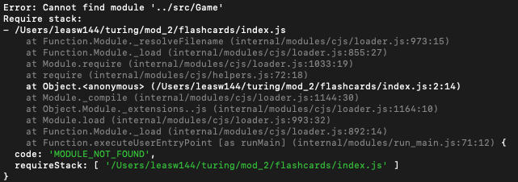
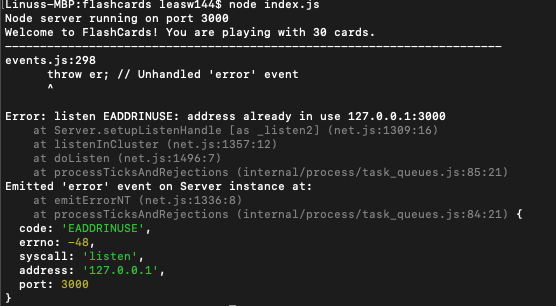

# FlashCards Starter Kit

## Abstract
This is the first solo project for Mod 2 2005. Flash cards is a game designed to be played via the terminal that quizzes the user on a set of predetermined questions. After all cards have been answered, the user gets a score on the percentage of answers they got right.

# Install instructions

## Fork This Repo
On the top right corner of this page, click the **Fork** button.
## Setup
Clone down the forked repo (from your GitHub). Since you don't want to name your project "flashcards-starter", you can use an optional argument when you run `git clone` (you replace the `[...]` with the terminal command arguments):
```bash
git clone [remote-address] [what you want to name the repo]
```
Once you have cloned the repo, change into the directory and install the library dependencies. Run:
```bash
npm install
```

Running `node index.js` from the root of your project should result in the following message being displayed in your terminal: 

```bash
Node server running on port 3000
```
## Things to note about this project
### Functionality
It doesn't work. As it is right now, there are issues with the either the module not being found or the server already being in use. Due to the encountering the issue at such a late stage in the project, there wasn't enough time to debug and meet MVP. 




## Testing
This was my first forray into TDD this extensively so organization and refactoring are notably disorganized. Additionally, had some tests that I would have liked to have done more 'sad path' testing on but due to time constraints, those tests were removed as were the relevant code as the goal was to meet MVP.

## Future attempts
For future attempts into TDD, I'd want to have a more clearer understanding of the code I'm working with and structure of the project itself; One of the stumbling blocks I encountered was simply not understanding the nature of Round and Turn which lead to some confusion later on.